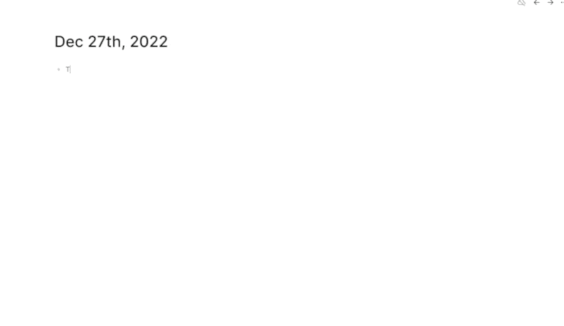

# Logseq Linear.app Integration

A utility to link your Linear.app issues with Logseq using the Linear issue id.



## Instructions

1. Install the plugin.
2. Go to the plugin Settings
3. Enter your Linear.app API key
   ```json
   {
     "LinearAPIKey": "lin_api_XXXXXXXX"
   }
   ```
5. In a block enter some text and then a Linear.app issue id:

```
- Dear diary,
- Today, I'll be working on UNI-12 
```
5. Then enter the slash command `/Extract Linear Issue`

### License

[MIT](./LICENSE)

### Shoutout

- I referenced this plugin when building: [https://github.com/sawhney17/logseq-twitter-extractor](https://github.com/sawhney17/logseq-twitter-extractor)
